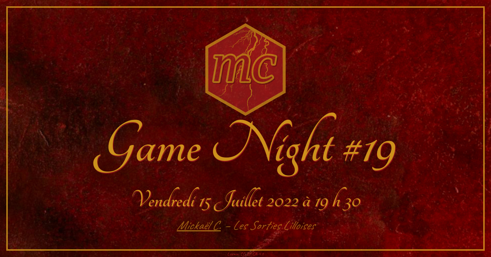

Game Night Poster

================

<!-- README.md is generated from README.Rmd. Please edit that file -->
<!-- badges: start -->

<!-- badges: end -->

## \[Jeux\] Game Night \#20 (MC)

<table>
<tr>
<td>

</td>
<td>

</td>
<td>

</td>
<td>

</td>
<td>

</td>
</tr>
</table>

    Limit<c3><a9> <c3><a0> 8 personnes (organisateur inclus).

    Ne vous inscrivez que si vous avez l'intention de venir, sinon choisissez "peut-<c3><aa>tre".
    En cas de d<c3><a9>sistement, veuillez actualiser votre statut sur l'<c3><a9>v<c3><a9>nement avant le jour J.
    Votre inscription devra <c3><aa>tre confirm<c3><a9> sur un groupe Messenger d<c3><a9>di<c3><a9>, 24 heures avant.

    Note : j'ai un jeune chien gentil, mais tr<c3><a8>s social ^^

    ----------------------------------------

    Salutations <c3><a0> vous, vous qui vous <c3><aa>tes <c3><a9>gar<c3><a9>-e-s ici et pas ailleurs !

    Il est important de noter et de rappeler que le monde se divise en deux* :
    - celles et ceux qui me connaissent.
    - celles et ceux qui ne me connaissent pas.

    * L'un de ces groupes a de la chance.

    Maintenant que ce rappel est fait, entrons dans le c<c5><93>ur de cet <c3><a9>v<c3><a9>nement.

    Commen<c3><a7>ons par les choses importantes, l'id<c3><a9>e est de r<c3><a9>unir plusieurs personnes (dans un maximum de huit) autour d'un <c2><ab> potluck <c2><bb>, pour reprendre le terme anglais d'Am<c3><a9>rique du Nord (c.-<c3><a0>-d., en bon fran<c3><a7>ais un <c2><ab> repas-partag<c3><a9> <c2><bb>), et ce, chez moi dans le secteur du Vieux-Lille* (Rue Esquermoise / Royale) de 19 h 30 <c3><a0> XX h XX.

    D<c3><a8>s lors que le stock de victuailles aura atteint une quantit<c3><a9> n<c3><a9>cessaire et suffisante, il nous sera alors possible de partir dans une (ou plusieurs) <c2><ab> aventure(s) <c2><bb> d'environ 30-45 minutes selon le jeu.

    * L'adresse sera communiqu<c3><a9>e aux participants par message priv<c3><a9> (ou m<c3><a9>thode similaire) 45-60 minutes avant.
    Aucune autre communication par ce support ne sera r<c3><a9>alis<c3><a9>e par l'oganisateur.

    #jeuxdesoci<c3><a9>t<c3><a9> #boardgames

    ----------------------------------------

    Contenu/Images sous licence CC-BY-SA-4.0

Voir toutes les affiches.

<table>
<tr>
<td>

</td>
<td>

</td>
<td>

</td>
<td>

</td>
</tr>
<tr>
<td>

</td>
<td>

</td>
<td>

</td>
<td>

</td>
</tr>
<tr>
<td>

</td>
<td>

</td>
<td>

</td>
<td>

</td>
</tr>
<tr>
<td>

</td>
<td>

</td>
<td>

</td>
<td>

</td>
</tr>
<tr>
<td>

</td>
<td>

</td>
<td>

</td>
<td>

</td>
</tr>
</table>

