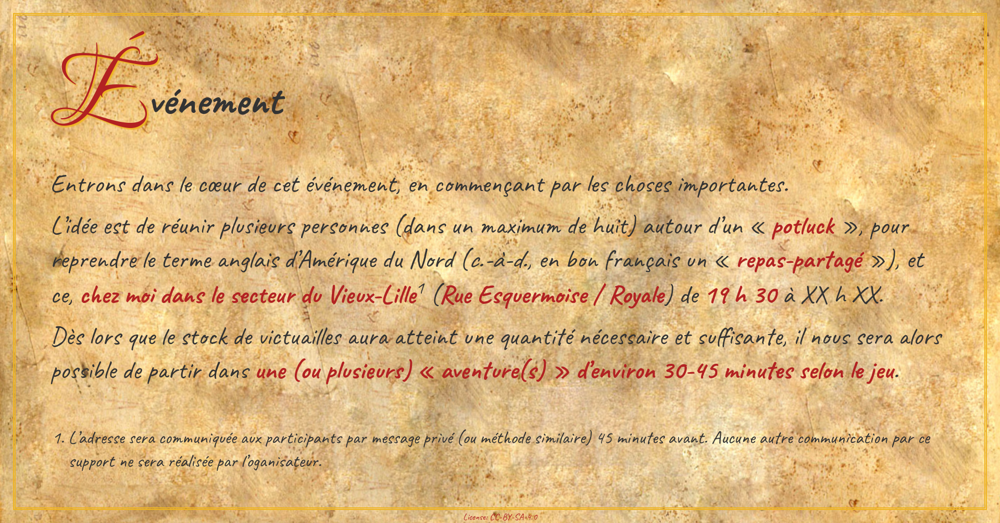
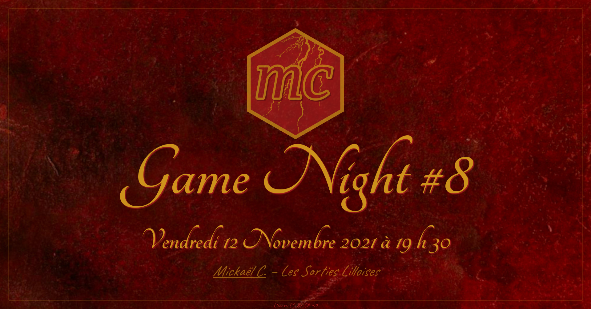

Game Night Poster

================

<!-- README.md is generated from README.Rmd. Please edit that file -->
<!-- badges: start -->

<!-- badges: end -->

## \[Jeux\] Game Night \#18 (MC)

<table>
<tr>
<td>

</td>
<td>

</td>
<td>

</td>
<td>

</td>
<td>

</td>
</tr>
</table>

    Limité à 5/6/7 personnes (organisateur inclus).

    Validation des inscriptions ("Participe" = engagement), par ordre d'arrivée sur un groupe Messenger dédié, 24 heures avant.

    Note : j'ai un jeune chien gentil, mais très social ^^

    ----------------------------------------

    Salutations à vous, vous qui vous êtes égaré-e-s ici et pas ailleurs !

    Il est important de noter et de rappeler que le monde se divise en deux* :
    - celles et ceux qui me connaissent.
    - celles et ceux qui ne me connaissent pas.

    * L'un de ces groupes a de la chance.

    Maintenant que ce rappel est fait, entrons dans le cœur de cet événement.

    Commençons par les choses importantes, l'idée est de réunir plusieurs personnes (dans un maximum de huit) autour d'un « potluck », pour reprendre le terme anglais d'Amérique du Nord (c.-à-d., en bon français un « repas-partagé »), et ce, chez moi dans le secteur du Vieux-Lille* (Rue Esquermoise / Royale) de 19 h 30 à XX h XX.

    Dès lors que le stock de victuailles aura atteint une quantité nécessaire et suffisante, il nous sera alors possible de partir dans une (ou plusieurs) « aventure(s) » d'environ 30-45 minutes selon le jeu.

    * L'adresse sera communiquée aux participants par message privé (ou méthode similaire) 45-60 minutes avant.
    Aucune autre communication par ce support ne sera réalisée par l'oganisateur.

    #jeuxdesociété #boardgames

    ----------------------------------------

    Contenu/Images sous licence CC-BY-SA-4.0

Voir toutes les affiches.

<table>
<tr>
<td>

</td>
<td>

</td>
<td>

</td>
<td>

</td>
</tr>
<tr>
<td>

</td>
<td>

</td>
<td>

</td>
<td>

</td>
</tr>
<tr>
<td>

</td>
<td>

</td>
<td>

</td>
<td>

</td>
</tr>
<tr>
<td>

</td>
<td>

</td>
<td>

</td>
<td>

</td>
</tr>
<tr>
<td>

</td>
<td>

</td>
</tr>
</table>

